# Group Project: Design Journey

**For each milestone, complete only the sections that are labeled with that milestone.** Refine all sections before the final submission.

You are graded on your design process. If you later need to update your plan, **do not delete the original plan, leave it in place and append your new plan _below_ the original.** Then explain why you are changing your plan. Any time you update your plan, you're documenting your design process!

**Replace ALL _TODOs_ with your work.** (There should be no TODOs in the final submission.)

Be clear and concise in your writing. Bullets points are encouraged.

Place all design journey images inside the "design-plan" folder and then link them in Markdown so that they are visible in Markdown Preview.

**Everything, including images, must be visible in _Markdown: Open Preview_.** If it's not visible in the Markdown preview, then we can't grade it. We also can't give you partial credit either. **Please make sure your design journey should is easy to read for the grader;** in Markdown preview the question _and_ answer should have a blank line between them.

## Client (Milestone 1)

### Client Description (Milestone 1)
> Tell us about your client. Who is your client?
> Explain why your client meets the client rules in the project requirements.

The client is Cornell Tech Consulting, a Cornell consulting club. Our contact is Vice President of New Member Education and Client Relations at Cornell Tech Consulting.

Client meets client rules in project requirements as it is a campus club, and we are designing for an audience that is not our immediate group.

### Client Questionnaire (Milestone 1)
> Develop a client questionnaire to learn more about your client and their goals.
> You may use the questionnaire below, you may modify the questionnaire below, or you may create your own.

1. Describe your organization and its purpose.

Our goal is preparing students for careers in consulting and we consult with local companies.

2. What makes your organization and its services special or unique?

We offer the opportunity to learn about consulting through hands-on work.

3. Why are you looking for a new website or updating your existing site?

It could have a more appealing design language and reflect our goals better.

4. Who do you want to visit your site? Who do you believe is your website's intended audience?

Our intended audience is people who want to learn more about the organization and prospective members.

1. When visiting your site, what actions do you want your visitors to take?

To achieve their goals in learning about our club.

6. What are your goals for this site?

Make it look better and show us off in the best light.

7. Is there a "feel" that you want for your site? Are there colors or imagery that you have in mind?

Use our color theme. Simple navigation. Similar content.

8. What are your three favorite competitors or similar organizations' websites? Why?

IBC (good images, simple theme, more detailed), Cornell Consulting Group (dropdown menu on nav, Contact page), and Cornell Consulting (image animations, more detailed join/apply slide)

### First Client Meeting Minutes/Notes (Milestone 1)
> Include your notes/minutes from your first meeting with your client.

Organization: Aims to prepare students for consulting careers and offers consultation to local companies, emphasizing hands-on learning.

Unique Selling Point: Hands-on consulting work experience.

Website Update Reason: To enhance design appeal and better reflect organizational goals.

Audience: Individuals interested in the organization, prospective members, and clients.

Visitor Goals: To learn about and engage with the organization.

Site Goals: Improve aesthetics and positive representation.

Design Preferences: Stick to existing color theme, simple navigation, and maintain content similarity.

### Client Website (Milestone 1)
> Tell us about the website that your client wants.
> Tell us the purpose of the website and what it is all about.
> Note: **If you are redesigning an existing website, give us the current URL and some screenshots of the current site.** (FireFox makes it easy to take a full screenshot of a page from the context menu (right click).)
> If you are redesigning an existing site, tell us how you plan to update the site significantly that meets the project's requirements.

current url: <https://cornelltc.com/>

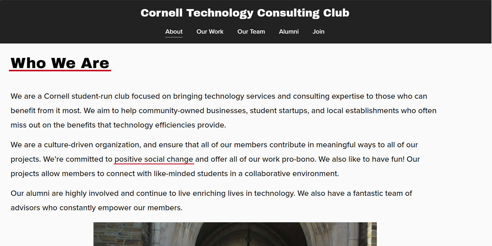
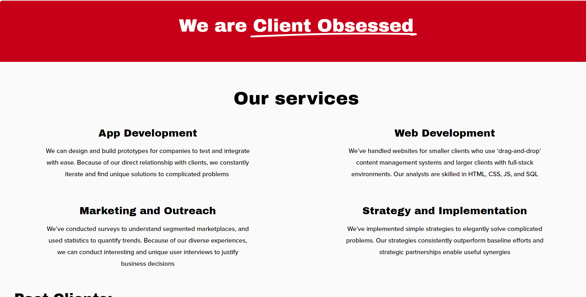

The redesigned website that would better align with our client's goals would be one that employed much stronger design appeal to better reflect the goals and purpose of the organization which are to showcase the club's achievements, services, and activities to prospective new members, but also demonstrate their professional services to prospective clients that seek their consulting services.

So, some design choices we can use to update the existing site significantly are:
    - display branding consistency: there is currently no logo on the website, however, we can include the logo from the organization's Instagram page and add that to every page on the new website to help establish a stronger brand image to clients.
    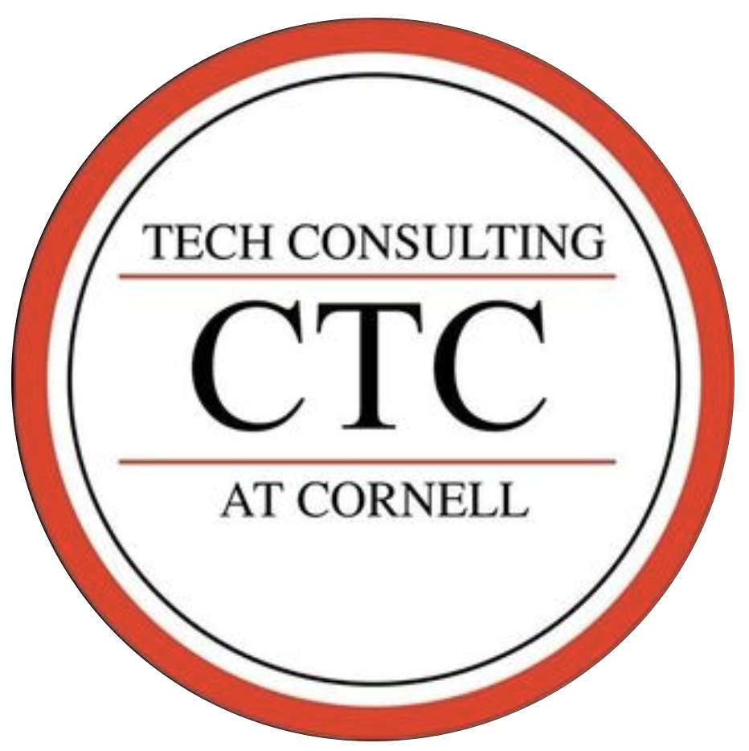
    -employ more aesthetics to match client request of simple design and navigation
        -use more white space, improve typography to use a consistent font
    -check for responsive design
        -on mobile devices, the website is not scaled as appropriately and it is difficult for clients to view page components appropriately. should add media queries here to improve responsiveness
    - a big step we can take to upgrade the website is include more interactivity
      - include elements like tap to click to see more information about a specific client the club has worked with
      - utilize hide and show information interactivity so that users can customize a more relevant viewing experience (especially with the past client section of the Our work page.)

### Client Goals (Milestone 1)
> Identify your client's goals for the website.
> What kind of website do they want? What are their goals for the site?
> There is no required number of goals. You need as many goals as necessary to reflect your client's desires.

- Goal 1: Inform users about the organization's goals and activities.
- Goal 2: Highlight the organization's excellency.
- Goal 3: Attract potential members and clients.

### Client Website Scope (Milestone 1)
> We want your project to be successful! It needs to be ambitious, but not too large.
> A good rule-of-thumb is that you should have about 1 content-full page for each team member.
> Explain why the website you will create for your client isn't too small and isn't too big.
> Explain why you think it's the right size for this project.

We plan for the website to have 4 content-rich pages. Currently the website has five pages, but we plan to merge two of them to make the navigation easier and to streamline the design. With a page for each team member, the project will be manageable while still being complex enough for our client's needs. All the information in the current version of their website will remain, but it will hopefully take a simpler form. Overall, this size aligns with our client's goals while keeping in consideration our respective abilities and time commitments.

## Plan/Schedule (Milestone 1)
> Make a plan of when you will complete all parts of this assignment.
> This plan is for your team. There is no required format. Format it so that it works for you!
> Your plan should include when you will interview users and analyze their goals.
> Your plan should also include how and when you will assemble/create the sit's content.
> **Tip:** Your team should plan to work ahead. This project really isn't feasible to complete the night before a deadline.

- We want to meet with our client on April 18th, the week before milestone 2, and April 25th, the day after milestone 2.
- We want to conduct user interviews the week after spring break, pending team member availability.
- We want to meet and analyse our interview results the Friday after spring break.
- Milestones are to be completed incrementally in the weeks leading to the deadline. All members will have their part finished the weekend before the deadline. We will then convene to ensure that each of our parts fits together and meets the project requirements. After final edits, we plan to submit the day of the deadline.

## Understanding Users (Milestone 2)

**Make the case for your decisions using concepts from class, as well as other design principles, theories, examples, and cases from outside of class.**

You can use bullet points and lists, or full paragraphs, or a combo, whichever is appropriate. The writing should be solid draft quality, but it doesn't have to be fancy.

### User Interview Questions (Milestone 2)
> Plan the user interview which you'll use to identify the goals of your site's audience.
> You may use the interview template below and revise it as much as you desire.

**User Interview Briefing & Consent:** "Hi, I am a student at Cornell University. I'm currently taking a class on web design and for a project, I am designing the website for (TODO: client's name). I'm trying to learn more about the people that might use this site. May I ask you a few questions? It will take about 10 minutes. You are free to quit at any time."

1. Please tell me a bit about yourself. You may omit any personal or private information.
2. When was the last time you accessed a club's website? Follow up: what were you looking for?
3. Are you currently a member or interested in joining a club related to technology or business, why or why not?
4. Are you aware of the Cornell Technology Consulting club? If so, how did you become aware?
5. How do you typically engage with clubs or organizations on campus?
6. Where would you look for information regarding joining a club?
7. What challenges have you encountered when using similar websites?

...

n. What haven't I asked you today that you think would be valuable for me to know?

**After the interview:** "This was really helpful. Thank you so much for agreeing to speak with me today. Have a great day!"

### Interview Notes (Milestone 2)
> Interview at least 1 person for every member of your team from your audience.
> Take notes and include those notes here. Make sure to include a brief description of each interviewee.
> **Copy the interview questions above into each interviewee section below.**
> Take notes for each participant **inline** with the questions.

**Interviewee 1:**
Hannah Bonafede

1. Please tell me a bit about yourself. You may omit any personal or private information.
Hannah Bonafede -- sophomore transfer from Notre Dame. Econ major, Psych minor. Grew up in Tokyo, Japan.

1. When was the last time you accessed a club's website? Follow up: what were you looking for?
SWIB website yesterday. Wanted to look at e-board, usually goes on website to look at e-board

1. Are you currently a member or interested in joining a club related to technology or business, why or why not?
Curreently in SWIB but won't be joining any other ones. Will be a junior and feels a lot of clubs don't take juniors, also a large time commitment.

1. Are you aware of the Cornell Technology Consulting club? If so, how did you become aware?
No

1. How do you typically engage with clubs or organizations on campus?
Through friends that are in the clubs that tell about events or try to get to participate in things

1. Where would you look for information regarding joining a club?
Website or Instagram

1. What challenges have you encountered when using similar websites?
A lot aren't polished, hard to navigate and not very organized. Not frequently updated. but usually finds websites to be useful regardless

1. What haven't I asked you today that you think would be valuable for me to know?
Technology is really difficult to use. Not tech savvy, so maybe taking that into consideration when creating websites. Being mindful b/c everyone has diff levels of comfortableness w/ tech

**Interviewee 2:**

1. Please tell me a bit about yourself. You may omit any personal or private information.

Shakir - freshman in Economics from Ohio. He is interested in business and crypto.

2. When was the last time you accessed a club's website? Follow up: what were you looking for?

I went to CCG's website during recruitment - I was looking for how to apply/join.

3. Are you currently a member or interested in joining a club related to technology or business, why or why not?

I am interested, but I am not in any clubs yet. Interested in crypto, finance, and consulting clubs.

4. Are you aware of the Cornell Technology Consulting club? If so, how did you become aware?

No.

5. How do you typically engage with clubs or organizations on campus?

Go to events, hear about clubs from friends, or look for ones to join online (campus groups or google)

6. Where would you look for information regarding joining a club?

Googling them online

7. What challenges have you encountered when using similar websites?

Some look juvenile, which says a lot about what the club is like/how serious it is. A lot have bad mobile websites that make it hard to view on a phone. Sometimes club websites have typos or just look ugly.

8. What haven't I asked you today that you think would be valuable for me to know?

No.

**Interviewee 3:**

1. Please tell me a bit about yourself. You may omit any personal or private information.

   Sophia - sophomore in Hotel Administration, from Seattle, Washington. She is interested in consulting and marketing.

2. When was the last time you accessed a club's website? Follow up: what were you looking for?

   Last accessed Social Enterprise Group at Cornell's (SEGC) website beginning of semester. Looking to apply to organization and wanted to learn more about applicant process and club purpose.

3. Are you currently a member or interested in joining a club related to technology or business, why or why not?

   Yes, now in International Business Consulting and Social Enterprise Group at Cornell. Interested in joining tech consulting for networking and hands on experience.

4. Are you aware of the Cornell Technology Consulting club? If so, how did you become aware?

   Looked it up "consulting" and "cornell" keywords through google search and organization was recommended.

5. How do you typically engage with clubs or organizations on campus?

   Goes to club fair and attends own clubs' gbody and trainings.

6. Where would you look for information regarding joining a club?

   Club fair or cornell activities directory.

7. What challenges have you encountered when using similar websites?

   If I haven't talked to a people in a specific club, it is hard to gauge how professional they are so I really rely on online resources like the club website to assess how worth my time it is to get to learn more. If I can find club board's linkedin or club's work, I am more keen on exploring more. If this information is ambiguous, then it is a lot harder for me to find the desire to proceed.

8. What haven't I asked you today that you think would be valuable for me to know?

    No

** Interview 4: **
1. Please tell me a bit about yourself. You may omit any personal or private information.
Alex, Freshman majoring in CS and minoring in Business. From Seattle, Washington.
2. When was the last time you accessed a club's website? Follow up: what were you looking for?
Last week he visited the App Dev website, looking for information on joining the club.
3. Are you currently a member or interested in joining a club related to technology or business, why or why not?
He is part of two tech related clubs, so he is not interested in joining furhter clubs.
4. Are you aware of the Cornell Technology Consulting club? If so, how did you become aware?
He is not aware of the Cornell Technology Consulting club.
5. How do you typically engage with clubs or organizations on campus?
Mostly through social media and club meetings and events.
6. Where would you look for information regarding joining a club?
Check the website, social media pages, or reach out to club officers.
7. What challenges have you encountered when using similar websites?
He said some websites are not user-friendly. They have confusing layouts and it’s hard to find specific information. Also, some websites are not updated regularly, so the information is outdated.
8. What haven't I asked you today that you think would be valuable for me to know?
Nothing came to mind.

### Goals (Milestone 2) -- Angelina
> Analyze your audience's goals from your notes above.
> List each goal below. There is no specific number of goals required for this, but you need enough to do the job (Hint: It's more than 1 and probably more than 2).

Goal 1: Enhance user experience and accessibility of the website

- **Design Ideas and Choices** _How will you meet those goals in your design?_
  - Clean, effective and intuitive responsive design with clear navigation such as a hamburger menu for familiar design to increase accessibility.
  - Design that is compatible with narrow and wide screen choices that presents content accordingly.
- **Rationale & Additional Notes** _Justify your decisions; additional notes._
  - Many users we interviewed mentioned that they access club websites from links in social media, given the mobile nature, we will need to make sure the website looks highly accesible and still appropriately designed at varying sizes.

Goal 2: Convey professionalism and organziation credibility

- **Design Ideas and Choices** _How will you meet those goals in your design?_
  - We will add the organization's logo to headers across all pages to improve website's uniformity, implement a consistent and sleek color theme across to our client's desire, and also include the linkedin and instagram profile of organization  on the website to improve credibility.
- **Rationale & Additional Notes** _Justify your decisions; additional notes._
  - User interviewees also highlighted judging professionalism of the organization largely from how well done their websites looked, so the design choices we will implement here will greatly improve consistent professionalism as well as credibility through allowing users to access contact information of the club through third means and employing a more professional consistency in design choice with logo and theme.

Goal 3: Showcasing past projects and clientele

- **Design Ideas and Choices** _How will you meet those goals in your design?_
  - We will implement a image carousel as an interactivity element within the website to showcase previous clients that the organization has partnered with in the "Our Work" page of the client website. Each image in the carousel should be clickable allowing users to view more details about the specific client by redirecting them to a dedicated page.
- **Rationale & Additional Notes** _Justify your decisions; additional notes._
  - User interviewees also highlighted seeing hands on experience as an important factor to them, so enlisting multimedia such as company logos and linked external websites can further increase dynamic elements and also help showcase the organization's credibility and lets users learn more about the club.

### Audience (Milestone 2) -- Angelina
> Briefly explain your site's audience.
> Be specific and justify why this audience is a **cohesive** group with regard to your website.

The site's audience for the redesigned website is undergraduate students at Cornell University who are interested in joining Cornell Technology Consulting Club or interested in exploring related fields in technology consulting and business. The audience is a cohesive group with regard to the client website because they share common interests in tech consulting and advancing their skills in business and technology and are likely to have similar motivations for visiting the website such as looking for information about networking with current club Eboard, learning about the previous partners of the organization, and also potentially looking for the forms to apply to join the organization.

## Website Design Exploration (Milestone 2) -- Angelina

Identify three websites (preferably static websites) that exist today on the web to draw inspiration from. Please select websites that are similar to the website you wish to create.

Include two screenshots of the home page for each site: narrow and wide.

**We'll refer to these are your "example websites."**

1. <https://www.socialenterprisegroupatcornell.com/>

    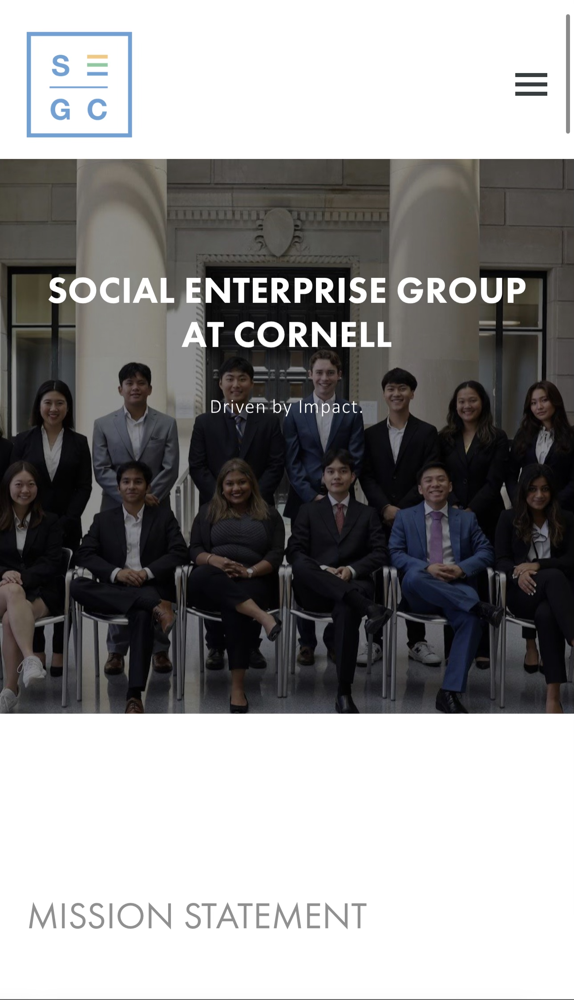

    

2. <https://www.cornellconsultingclub.org/>

    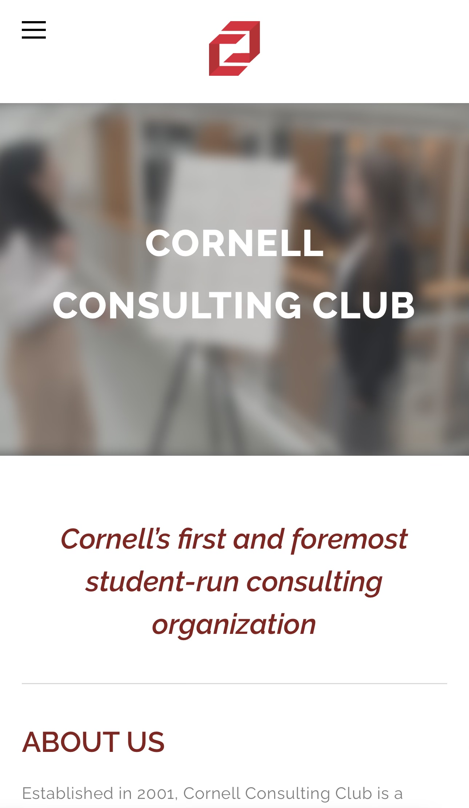

    

3. <https://cornellfinanceclub.org/>

    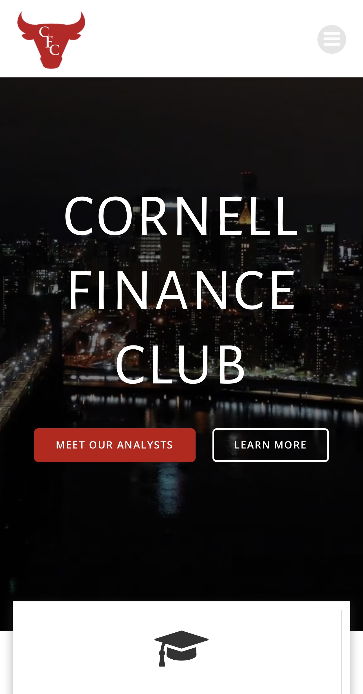

    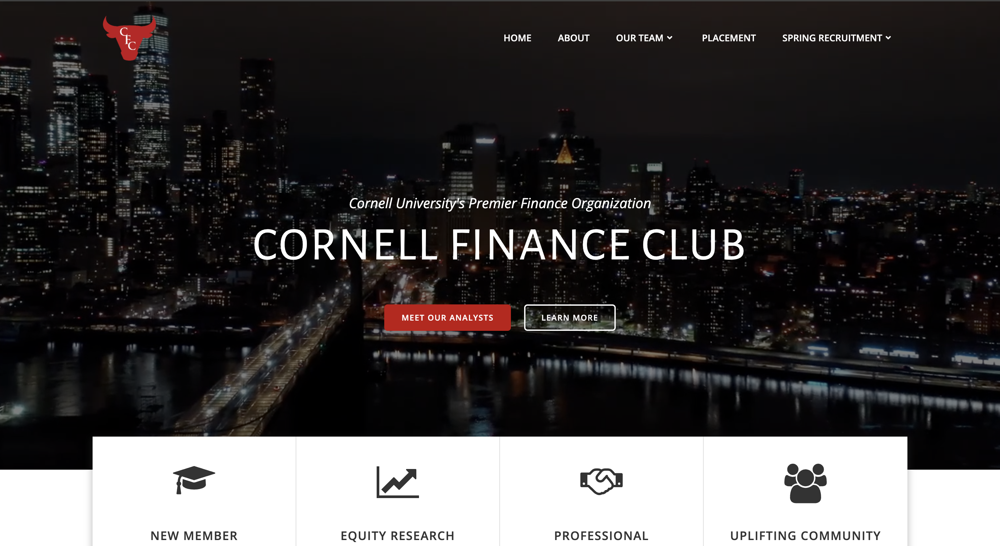

### Example Website 1 Review (Milestone 2) -- Angelina
> Review the website you identified above. (1 paragraph)
> In your review, include a discussion common design patterns and interactivity in the site.

Website has their logo in the header, full name of organization in bold at the top of the home page, and mission statement as the subheader of the home page. Website employs common design patterns such as good responsive and interactive design, website's hambuger menu drops down effectively and screen narrows and widens accordingly. Good design theme as it adheres to logo colors of blue, yellow, green and white and this scheme is followed consistently throughout. Font family is legible and appropriate sizing. Pages are labeled effectvely for smooth user experience. Good interactivity with buttons that hovers to darken and link to external websites to learn more.

### Example Website 2 Review (Milestone 2) -- Angelina
> Review the website you identified above. (1 paragraph)
> In your review, include a discussion common design patterns and interactivity in the site.

Website has their logo in the middle of their header in the middle of the nav bar, full name of organization in bold at the top of the home page. Website employs common design patterns such as good responsive and interactive design, website's hambuger menu drops down effectively and screen narrows and widens accordingly, and nav bar in wide screen has a good drop down to view subpages design. Good design theme as it adheres to logo colors of maroon and white and this scheme is followed consistently throughout. Font family is legible and appropriate sizing. Very accessible for users to find information on current members and who to reach out to, linkedin also available.

### Example Website 3 Review (Milestone 2) -- Angelina
> Review the website you identified above. (1 paragraph)
> In your review, include a discussion common design patterns and interactivity in the site.
>
Website has their logo in the header, full name of organization in bold at the top of the home page, and mission statement as the subheader of the home page. Website employs common design patterns such as good responsive design, website's hambuger menu drops down effectively and screen narrows and widens accordingly. Good design theme as it adheres to logo colors of red, black, and white and this scheme is followed consistently throughout. Font family is legible and appropriate sizing. However, doesn't have as much interactivity with partner's page, harder for users to click for more information.

## Content Planning (Milestone 2)

Plan your site's content.

### Your Site's Planned Content (Milestone 2) -- Julia
> List **all** the content you plan to include your website.
> You should list all types of content you planned to include (i.e. text, photos, images, etc.)
> Briefly summarize the content; do not include the content here.

- We will mostly be using text from the existing Cornell Tech Consulting Club website. However, their current website has text on different pages that are a little redundant, so we are going to cut down the text a little bit. But for the most part we are taking the current text from the website.
- We will also be using the current photos on their website. This includes the team photo, individual photos of the Eboard, and images of the logos of their past clients. Additionally, we are adding their club logo found on their instagram, as well as 2 photos taken from their instagram on the "Join" page since there are no photos in their current website on this page.
- Overall, the content is generally the same as the current website–we are mainly focusing on redesigning the website's look.

### Content Justification (Milestone 2) -- Julia
> Explain (about a paragraph) why this content is the right content for your site's audience and how the content addresses their goals.

Since the site's audience is undergraduate students at Cornell University who are interested in joining Cornell Technology Consulting Club or exploring a relative field, we want to make sure that we keep substantial and informative content on the website. Therefore, we want to keep a detailed description of what Cornell Tech Consulting Club does as an organization (found on the home "About Us" page). This allows prospective students to immediately find an overview of the club right when they access the website. Additionally, we decided to keep detailed aspects of their work in the "Our Work" page for prospective students to learn about, as well as team members, their majors, and years and alumni placement under the "Our Team" page. We considered cutting out some information, like team members' majors, but we thought this was important to keep so prospective students can gain a better understanding of what academic backgrounds the members come from so prospective students have a better idea if they would be a good fit. We decided to also add 2 images under the "Join" page since there are no images on their current website, and it looked a little bit bland. One image is especially informative, as it gives a full Recruitment timeline for the Spring 2024 cycle. We felt this was necessary since many students going on the website are probably interested in applying, and it would be useful to know dates and deadlines for the application process.

## Information Architecture (Milestone 2)

### Content Organization (Milestone 2) -- Julia
> Document your **iterations** of card sorting here. You must have at least 2 iterations of card sorting.
> Include photographic evidence of each iteration of card sorting **and** description of your thought process for each iteration.
> Please physically sort cards; please don't try and do this digitally.

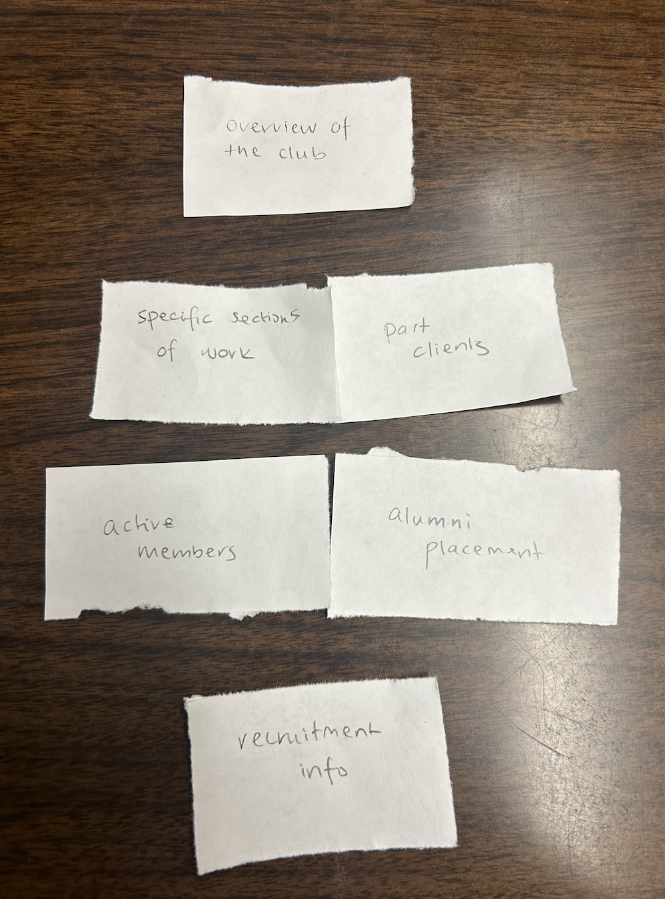
An overview of a club on the home page is the standard, so we wanted to stick with a format that would be familiar to most users. Specific sections of work and past clients are grouped together since they involve specifics of what the club does and who they work with. Active members and alumni placement are grouped together since it involves the students in the club, past and present. Recruitment information is its separate page since it relates specifically to prospective students.

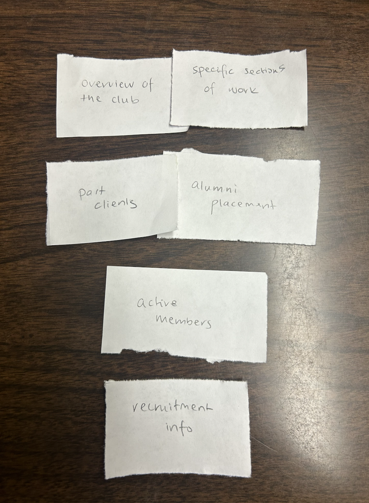
An overview of the club and speciic sections of work are grouped together since it gives a descriptive idea of what the club does and their actual action items. Past clients and alumni placement are grouped together since they both involve archived groups that might not be super relevant to the club anymore. Active members are on its own page since prospective students might just want to view who is in the club right now. Again, recruitment information is its separate page since it relates specifically to prospective students.

### Final Content Organization (Milestone 2) -- Julia
> Which iteration of card sorting will you use for your website?

We will be using card sorting #1.

> Explain how the final organization of content is appropriate for your site's audiences.

Card sorting #1 divides the content as follows: 1. overview of the club 2. specific sections of work + past clients 3. active members + alumni placement 4. recruitment information. This makes the most sense since prospective students would probably want to gain a general overview of the club on the home page before deciding to click on other pages that dive deeper into specific work and clients, members, and recruitment. This sorting allows students to learn more about specific work and the clients they have worked with on the same page, and then learn more about active members and where past members have gone on to work. This is better than cart sorting #2, which has an an overview of the club and the speific sections of work on the home page. This could be overwhelming for the site's audience, especially if a student just wants to know what the club is generally about and not their specific hands-on work. Additionally, it doesn't make much sense to put past clients and alumni placement on the same page; even though they are both relating to archived information, past clients have to do with the club's work relations while alumni placement refers more to the members within the club, which is why it makes more sense to use card sorting #1 where active members and alumni placement are on the same page.

### Navigation (Milestone 2) -- Julia
> Please list the pages you will include in your website's navigation.

Page 1 (home page): About Us
Page 2: Our Work
Page 3: Our Team
Page 4: Join Us

> Explain why the names of these pages make sense for your site's audience.

Page 1: Gives an overview of the club, their goals, and committments. Therefore, "About Us" makes the most sense. Prospective students can gain a general overview on this home page before deciding to dive deeper.

Page 2: Splits their work up into 4 different categories (app development, web development, marketing & outreach, strategy & implementation) with short descriptions underneath as well as past clients. We thought "Our Work" would be the most appropriate since prospective students will know to click here to learn more specifically about the work that goes on within the club.

Page 3: Has images of current members with their year + major, as well as alumni placement. Therefore, "Our Team" is appropriate here; prospective students will know to click on this page to learn more about who is a part of the club

Page 4: Includes dates and deadlines about applying to join the club, so "Join Us" would be appropriate since prospective students would probably click this page if they want to apply.

## Visual Theme (Milestone 2) -- Lucas
> Discuss several (more than two) ideas about styling your site's theme. Explain why the theme ideas are appropriate for your target audiences. Note the theme you selected for your site and why it's appropriate for the audience and their goals.

Theme Idea 1: The first theme utilizes a color scheme of red, white and black, serif font, clean added decoration to pages, and a businessy feel. It will evoke some of the design patterns common in the sites for top consulting and financial service firms. This aligns with the target audience of Cornell students interested in business and technology because often times students join consulting clubs with the goal of gaining experience to get a job at similar companies.

Theme Idea 2: The second theme is the one we chose for out website. It utilizes the same color scheme. However, it opts for a more minimalist design with less decoration and sans serif fonts. It is very modern and tech-forward. It aligns with the target audience by communicating the ideas of innovation and technology. Students interested in joining a club with a heavy focus on web design consulting may prefer the more modern, high-tech look and feel. We felt that the business side of the club is sufficiently communicated through the text content, and that adding to the technological side through the theme would be more valuable.

## Design (Milestone 2)

Document your site's layout.

## Interactivity Brainstorm (Milestone 2) -- Daniel
> Using the audience goals you identified, brainstorm possible options for interactivity to enhance the functionality of the site while also assisting the audience with their goals.
> Briefly explain idea each idea and provide a brief rationale for how the interactivity enhances the site's functionality for the audience.
> Note: You may find it easier to sketch for brainstorming. That's fine too. Do whatever you need to do to explore your ideas.

- Idea 1: Hamburger menu for narrow screens in all pages. Rationale: A hamburger menu would provide greater accessibility to narrow screens and make the site's design less cluttered, allowing users to navigate with greater ease.
- Idea 2: Modal for team member images. When a team member image is clicked, the modal would pop up with a brief summary of the team member and would also show their relevant social media. Rationale: This modal would allow users to better get to know the team members, also facilitating communication with team members.
- Idea 3: Carousel for companies they work with. Rationale: Currently, the companies listed in the "Our Work" page simply listed out in 2 rows of 5 columns. By implementing a carousel in this page, users could flip through companies one by one to understand the club's past work. This will reduce clutter in the page and put a greater spotlight on the club's collaborations.
- Idea 4: Collapsable image gallery. In the "Our work" page, there are 10 pictures of companies the club works with, which somewhat clutters the page. An idea is to make the gallery toggable and collapsable with a button. This would help reduce clutter while increasing engagement as it should generate curiosoity about the button's content.

### Layout Exploration (Milestone 2) -- Lucas
> Iterate on your site's design through sketching.
> Sketch both the narrow and wide versions of the site.
> Here you are just exploring your layout ideas. You don't need to sketch every page.
> Include some of your interactivity ideas in your sketches.
> Provide an explanation for each sketch explaining the idea and the design patterns you are leveraging.

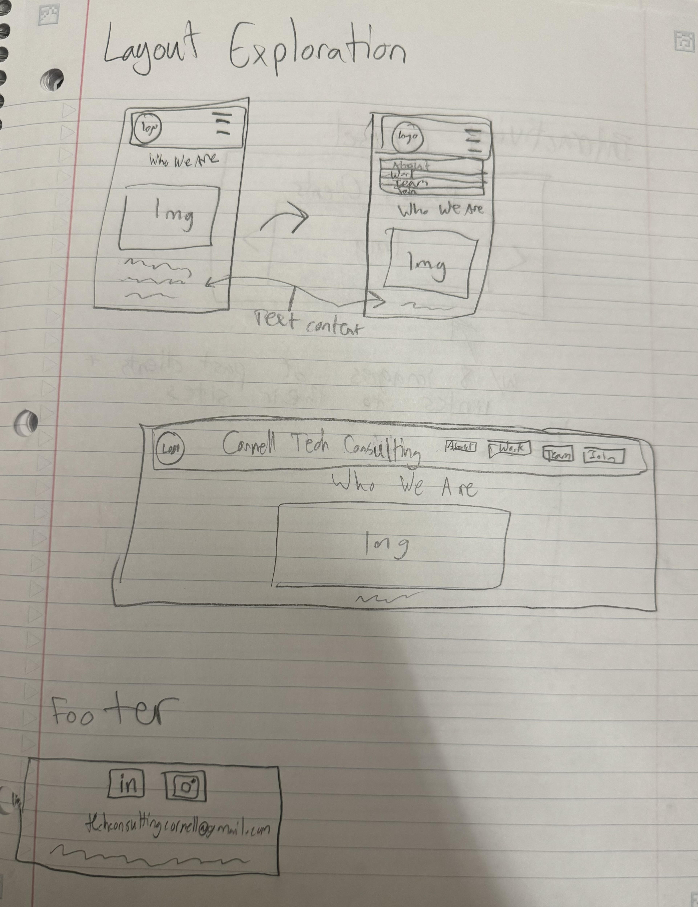
In this layout exploration, we played with the design of the home page in narrow and wide layouts. We demonstrated the use of the hamburger menu interactivity, which is a common design pattern that is useful for users on narrow screens. The sketch of the wide version of the page includes a navigation bar, which is a useful design pattern that helps users navigate the site. The footer contains contact information and is on every page, giving users the ability to reach out easily to ask questions or meet club members.

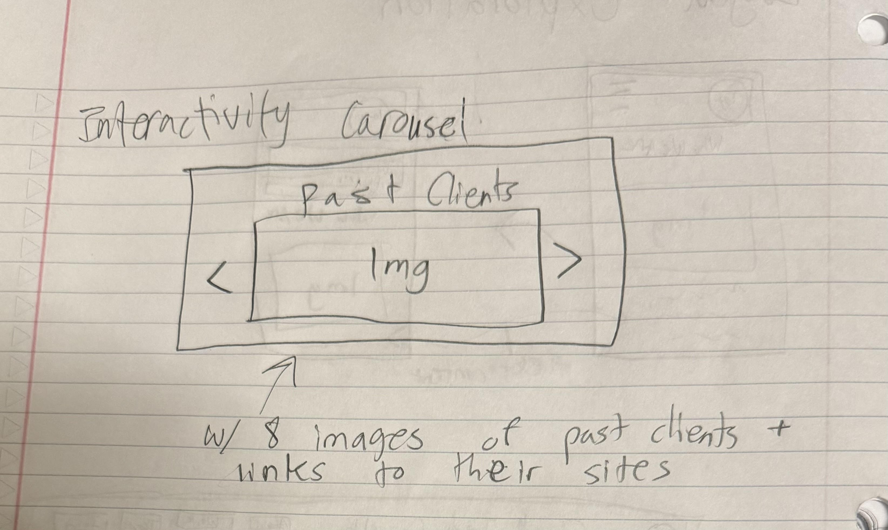
This second interactivity layout sketch shows a carousel interactivity for past clients. It would loop through client photos when the right or left arrow buttons are clicked. We found that the past clients section took up a lot of space on the original website, and it would be good for users to look at each past client more in detail. This carousel would accomplish that.

### Final Design (Milestone 2) -- Lucas
> Include the final sketches for each of your pages.
> **Include your final interactivity in your sketches.** Include annotations to explain what happens when the user takes an action with your interactivity.
> The sketches must include enough detail that another 1300 student could implement them.
> Please provide an explanation for each sketch.

**Narrow Design:**
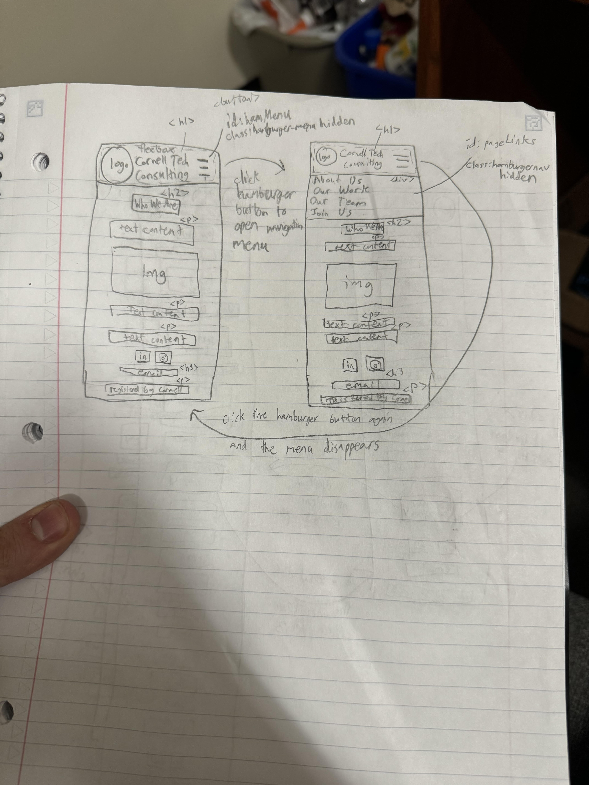
The About Us page combines the content of the original site's Home page and About page into one more content-rich page incorporating the theme. This sketch shows the hamburger menu interactivity, but this interactivity is accessible from all of the pages on the website.
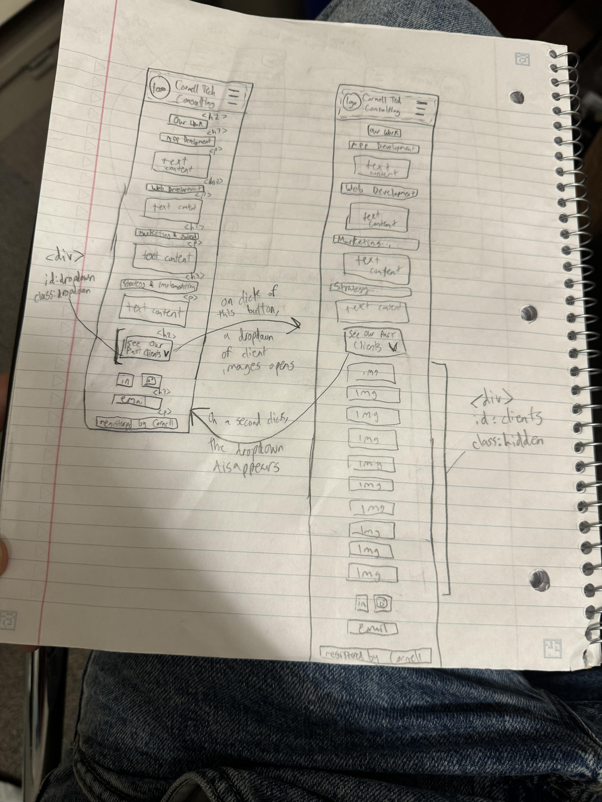
The Our Work page includes the services that the club provides and descriptions, along with a dropdown section of past clients. The dropdown section is an interactive element that hides the ten photos of client logos when closed. It can be opened and closed (toggle) with a click on the See Our Past Clients button.
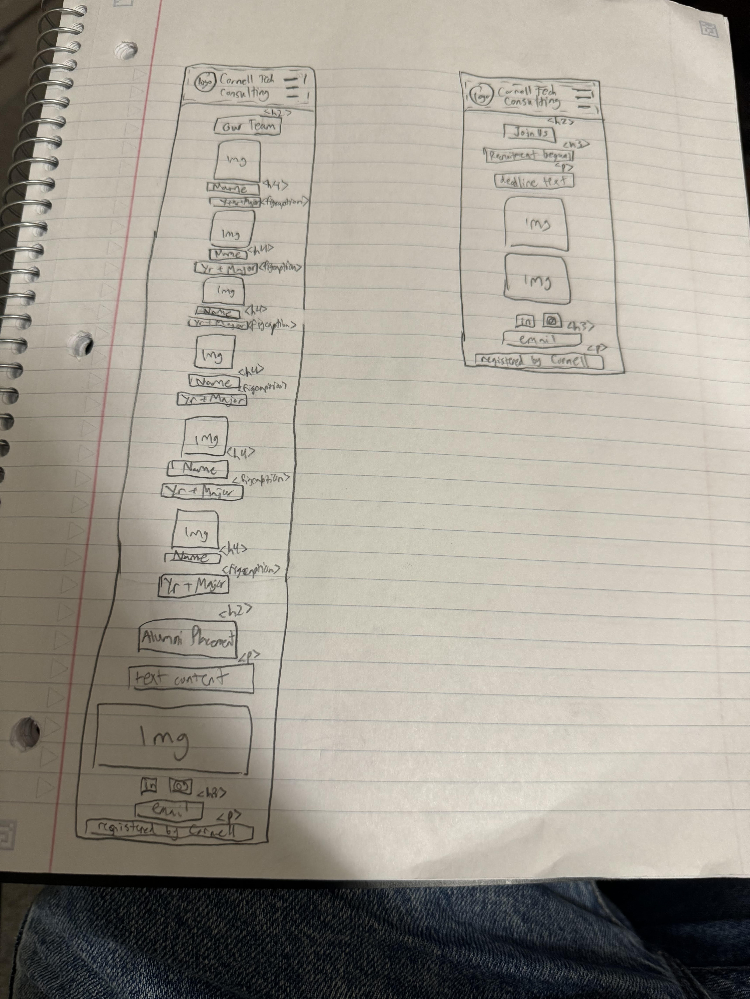
The Our Team page shows the members of the executive board of the club and information about alumni career outcomes. This consolidates two pages worth of content from the original site into one page that still retains a cohesive topic.
The Join Us page includes details about the recruiting season for the club, and when an application is available, it will be linked on the page. It also includes useful images of recruitment events and timelines.

**Wide Design:**

The wide version of the About Us page is meant to provide plenty of room for the user to breathe. The nav bar at the top is meant to invited them in and encourage navigation, and the large picture in the center will show a friendly face of the club.

The wide our work page is similar to other pages, but is less cluttered due to the dropdown gallery at the bottom of the page. The dropdown invites users to explore the club's professional engagements.
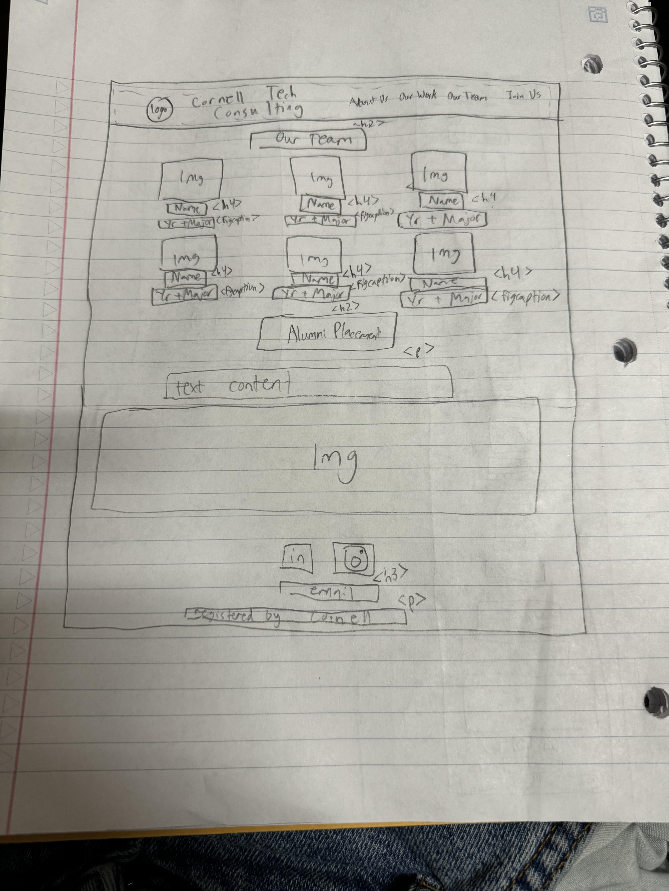
The wide version of the Our Team page includes a navigation bar at the top to allow users to find content. It also uses flexboxes to group three executive board members together in a row on the page (with two rows). Other than those changes, it follows the narrow design.
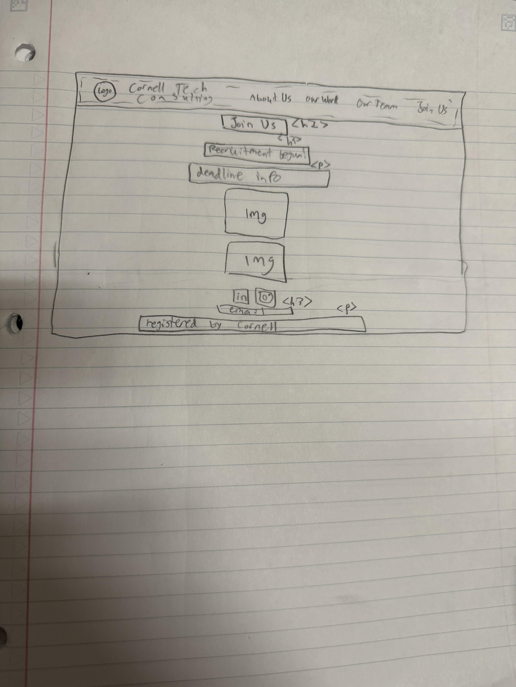
The narrow design for the Join Us Page worked very well and was super usable when turned into a wide version, so we only changed some font sizes.

### Design Rationale (Milestone 2) -- Lucas
> Explain why your design is appropriate for your audience.
> Specifically, why does your content organization, navigation, and site design/layout meet the goals of your users?
> How did you employ **design patterns** to improve the familiarity of the site for your audience?

The design is appropriate for our audience of undergraduate students at Cornell University who are interested in technology, business, and consulting student organizations. This is because of our straightforward and easy to navigate content organization that makes it easy for users to find what they are looking for and learn more about Cornell Tech Consulting. We consolidated the original website's pages into concise and content-rich pages, opting for depth in few pages rather than breadth across many pages. These choices empower users to complete their goals of applying to CTC and learning more about the club's mission, work, and members. We used a navigation bar, a hamurger menu, and images throughout to improve familiarity of the site and follow web design conventions.

## Interactivity Rationale (Milestone 2) -- Daniel
> Describe the purpose of your proposed interactivity.
> Provide a brief rationale explaining how your proposed interactivity addresses the goals of your site's audience and enhances their user experience.

The proposed interactivity aims to enhance user experience by improving accessibility, promoting engagement, and spotlighting key information. The hamburger menu simplifies navigation for users on narrow screens, reducing clutter and improving ease of use. The carousel for showcasing companies the club has worked with reduces page clutter and allows users to focus on each collaboration individually, thereby highlighting the club’s past work effectively. These interactive elements are designed to meet the needs of the site’s audience and enhance their overall experience.

## Interactivity Plan (Milestone 2) -- Daniel
> Now that you've designed your interactivity for your site, you need to plan how you will implement it.
> Describe how you will implement the interactivity. This should be a complete plan that another 1300 student could use to implement the interactivity.
> You should list the HTML elements, CSS classes, events, pseudocode, and the initial state.

Interactivity 1: Hamburger Menu

Hamburger Plan Sketch:

Pseudocode:
when window is resized (event):
    if document width is narrow:
        remove .hidden from #hamburger
        add .hidden to #topNav
    else
        add .hidden to #hamburger
        remove .hidden from #topNav

when #hamburger is clicked (event):
    if menuIsVisible is false:
        remove .hidden  from #menu
        set menuIsVisible to true
    else
        add .hidden  to #menu
        set isVisible to false

Interactivity 2: Collapsable image gallery

Collapsable Sketch:

Pseudocode:
when #galleryButton is clicked(event):
    if #imageGallery is not visible:
        remove .hidden from #imageGallery
    else
        add .hidden from #imageGallery

## Client Feedback & Minutes (Milestone 2) -- Lucas
> You should meet with your client again to obtain feedback on your design.
> Provide a summary of the client's feedback and your meeting's minutes.

Feedback: On Our Work page, I would prefer to have the services in-line with each other in a 2x2 grid. Also, add the client obsessed visual to the top of the page. I would prefer underlines over boxes around page headers and subheaders. Add links to client websites on Our Work page.

Meeting Minutes: 16 minutes

## User Testing (Final Submission)

**Conduct user testing with a minimum of 1 participant for every member of your team.**

### User Testing Tasks (Final Submission)
> Plan out your user testing tasks before doing your user testing.
> These must be actual user testing tasks.
> **Tasks are not questions!**

1. Imagine you are a student who wants to join the Cornell Tech Consulting club and are planning on applying. Please find the recruitment timeline.

2. You are a prospective club member interested in the club's previous work. Please find the past clients that they've worked it.

3. You are interested in learning more about the club and want to find their other social medias. Please find their Instagram and Linkedin.

4. Please find the club's student Treasurer.

### Participant 1 (Final Submission)
> Using your notes from above, describe your user by answering the questions below.

1. Who is your user, e.g., where does the user come from, what is the user's job, characteristics, etc.?

The user is Benjamin Ratin, a Computer Science major at Cornell University. He is 19 and a sophomore.

1. Does the user belong to your audience of the site?

    > If “No”, what’s your strategy of associating the user test results to your audience’s needs and wants? How can your re-design choices based on the user tests make a better fit for the audience?

Yes

### Participant 1 -- Testing Notes (Final Submission)
> When conducting user testing, you should take notes during the test.

1. Imagine you are a student who wants to join the Cornell Tech Consulting club and are planning on applying. Please find the recruitment timeline.

He briefly looked through the About US (home) page then clicked the Join Us page link on the navigation bar and found the recruitment timeline near the top of that page.

2. You are a prospective club member interested in the club's previous work. Please find the past clients that they've worked it.

Benjamin first clicked on the Our Work page, where he scrolled down to find the See Our Past Clients dropdown menu. He clicked to open the menu, but wasn't sure what companies the logos corresponded to. He noted that the images could be more useful if they were linked to the company websites so potential members could see the club's web development work.

3. You are interested in learning more about the club and want to find their other social medias. Please find their Instagram and Linkedin.

He scrolled to the bottom of the Our Work page and found the logos with links to their social medias.

4. Please find the club's student Treasurer.

Benjamin immediately clicked the Our Team page link in the navigation bar. Looking through the leadership team, he found the club's treasurer, Tushar Chaturvedi.

### Participant 2 (Final Submission)
> Using your notes from above, describe your user by answering the questions below.

1. Who is your user, e.g., where does the user come from, what is the user's job, characteristics, etc.?

   This participate's name is Hannah Bonafede. She is a sophomore at Cornell University majoring in Economics and minoring in Psychology, and her hometown is Tokyo, Japan.

2. Does the user belong to your audience of the site?

    > If “No”, what’s your strategy of associating the user test results to your audience’s needs and wants? How can your re-design choices based on the user tests make a better fit for the audience?

    No; Hannah is not partically interested in joining a Technology-related club as she is more interested in pursuing business. However, her user testing results can still be useful since she has looked into and applied to some of the business organizations who have similarly-formatted websites.

### Participant 2 -- Testing Notes (Final Submission)
> When conducting user testing, you should take notes during the test.

1. Imagine you are a student who wants to join the Cornell Tech Consulting club and are planning on applying. Please find the recruitment timeline.

She clicked on "Our Team" briefly before seeing there is a "Join Us" page. She quickly clicked on Join Us and found the image of the recruitment timeline.

2. You are a prospective club member interested in the club's previous work. Please find the past clients that they've worked it.

She clicked on Our Work, read through a little bit of the specific details of work the club does, and then finally found "See Our Past Clients" where she then clicked and was able to find past clients.

3. You are interested in learning more about the club and want to find their other social medias. Please find their Instagram and Linkedin.

Since Hannah was already at the bottom of the page after finding "See Our Past Clients," she quickly pointed out the Linkedin and Instagram logos. However, she didn't click on the logos initially and it took her a little bit to finally click on them, likely since there's no indication or visibility here that allows users to know they can click on the logos.

4. Please find the club's student Treasurer.

She clicked on the "Our Team" page and scanned the different members' descriptions until finally finding the student Treasurer.

### Participant 3 (Final Submission)
> Using your notes from above, describe your user by answering the questions below.

1. Who is your user, e.g., where does the user come from, what is the user's job, characteristics, etc.?

    Austin, senior at Cornell studying biology from Houston, Texas.

2. Does the user belong to your audience of the site?

    > If “No”, what’s your strategy of associating the user test results to your audience’s needs and wants? How can your re-design choices based on the user tests make a better fit for the audience?

    Yes, as a Cornell student he is in the target demographic of the website. The fact he is a senior should also give us valuable insights from his past years at Cornell.

### Participant 3 -- Testing Notes (Final Submission)
> When conducting user testing, you should take notes during the test.

1. Imagine you are a student who wants to join the Cornell Tech Consulting club and are planning on applying. Please find the recruitment timeline.
He immediately identified "Join Us" as the appropriate page, navigated to it, and found the relevant information.

2. You are a prospective club member interested in the club's previous work. Please find the past clients that they've worked it.
The user correctly identified "Our Work" as the page he needed to navigate to. There, he spent some time reading the text until seeing the dropdown button at the bottom. After clicking it, he was able to identify some of the past clients the club worked with. He was able to identify all but two logos.

3. You are interested in learning more about the club and want to find their other social medias. Please find their Instagram and Linkedin.
While navigating for the other tasks, Austin already noticed the two icons at the bottom of the pages. From the homepage, he quickly identified the logos and clicked them to find the relevant social medias.

4. Please find the club's student Treasurer.
Austin quickly navigated to "Our Team" and looked at the photos and descriptions of the eboard. After scanning their descriptions, he was able to identify the club treasurer.

### Participant 4 (Final Submission)
> Using your notes from above, describe your user by answering the questions below.

1. Who is your user, e.g., where does the user come from, what is the user's job, characteristics, etc.?

    Sophia is a Hotel Administration major from Seattle, Washington.

2. Does the user belong to your audience of the site?

    > If “No”, what’s your strategy of associating the user test results to your audience’s needs and wants? How can your re-design choices based on the user tests make a better fit for the audience?

   Yes, undergraduate from Cornell interested in consulting field's intersection with technology.

### Participant 4 -- Testing Notes (Final Submission)
> When conducting user testing, you should take notes during the test.

1. Imagine you are a student who wants to join the Cornell Tech Consulting club and are planning on applying. Please find the recruitment timeline.

Sophia was immediately able to identify the Join Us page and found the relevant information regarding recruitment.

2. You are a prospective club member interested in the club's previous work. Please find the past clients that they've worked it.

Sophia was able to navigate to the Our Work page and saw the logos with the clients. She was intrigued by the "TH" logo but as it didn't show the client's full name, she was unable to find more information.

3. You are interested in learning more about the club and want to find their other social medias. Please find their Instagram and Linkedin.

Sophia was able to see the linkedin logo and instagram logo at the bottom of the past clients section. She was able to successfully navigate to the appropriate social media pages.

4. Please find the club's student Treasurer.

Sophia was able to quickly navigate to the Our Team page and from the descriptions below each profile, she was able to identify the treasurer with ease.

## Website Revision Based on User Testing (Final Submission)
> What changes did you make to your design based on user testing?

When asking question #3 where users were asked to find the club's other social medias, one of our users had a little bit of difficulty recognizing that she was able to click on the Linkedin and Instagram icons on the bottom of the page to take her to their respective social media pages. Because of this, we agreed it was necessary to add more visibility and affordance here to give users more clear cues and indicate to users that they could click on the icons. Therefore, we added opacity to the icons when the user hovers over the icons. This is a standard feature that many websites use to indicate to users that the icons are clickable. Furthermore, we decided to add this same opacity when hovering feature to the past clients' icons since we also added links to the past clients' icons in response to user testing.

On question #2, multiple users mentioned feeling that they lacked information about which companies the client logos referred to in the See Our Past Clients dropdown menu. They also mentioned that they would like more information about the clients and the ability to see the web design work the club has done for the clients. To alleviate these issues, we added links to the clients' websites on their logos, and coupled with the lowered hover opacity to indicate that the logos are clickable, it increased the usability and effectiveness of our website for our audience.

## Grading (Final Submission)

### Collaborators (Final Submission)
> List any persons you collaborated with on this project.

None

### Reference Resources (Final Submission)
> Please cite any external resources you referenced in the creation of your project.
> (i.e. tutorials, W3Schools, StackOverflow, Mozilla, etc.)

MDN, StackOverflow, W3Schools
